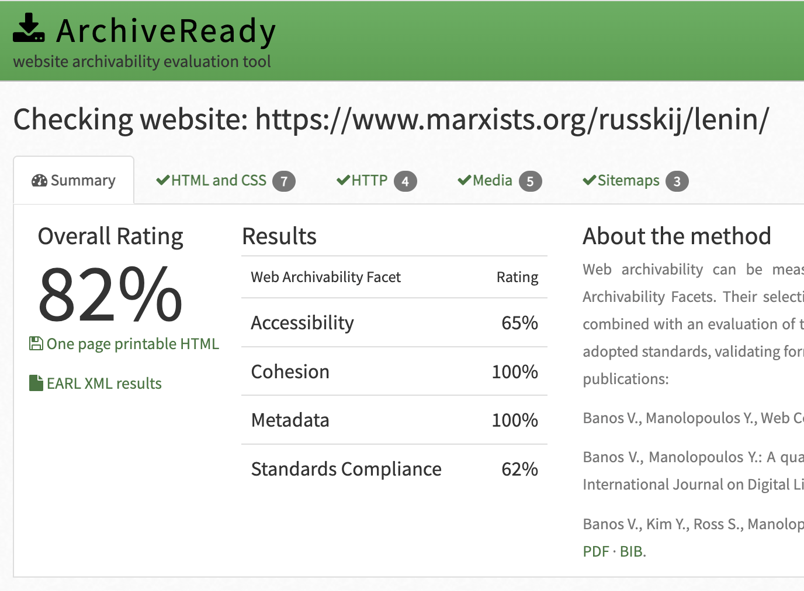

# Архив сайта: **marxists.org/lenin/**
**URL:** https://www.marxists.org/russkij/lenin/  
**Дата архивации:** 2025.11.23  
**Метод:** рекурсивное скачивание с фильтрацией по разделу

---

### Анализ архивируемости
Проверка архивируемости выполнена через **https://archiveready.com**

**Основные показатели:**

- Общий рейтинг: 82% 
- Robots.txt: There are "Disallow:" commands in your robots.txt file 
- Sitemap: No sitemap.xml found. 

**Скриншот результата:** 

* **Accessibility (доступность)** — может ли краулер получить доступ ко всем компонентам сайта — страницам, изображениям, скриптам; следит, открываются ли ресурсы по HTTP.
* **Cohesion (целостность)** - насколько сайт организован так, что все ресурсы связаны логично, нет «битых» ссылок или внешних зависимостей, которые краулер не может достать.
* **Metadata Usage (использование метаданных)** - наличие и корректная структура метаданных (урлов, описаний, MIME-типов и др.), что помогает корректному сохранению и извлечению контента позже.
* **Standards Compliance (соответствие стандартам)** - соответствует ли HTML/CSS/JS стандартам, корректно ли оформлен код, нет ли ошибок, которые помешают корректному парсингу/рендерингу.

---

### Архивирование (`wpull`)

Рекурсивное скачивание с фильтрацией по разделу /russkij/lenin/ и сохранением страниц в WARC-файл. 
Позволяет собрать весь корпус текстов Ленина с сайта, включая HTML-страницы, не скачивая лишние разделы. 
Структура сохраняется в виде WARC и отдельных HTML файлов. Подходит для исследовательского анализа текстов и визуализации сетевых связей между страницами.

**WARC-файл:** находится в каталоге [`lenin_download`](https://disk.360.yandex.ru/d/ZaM6L38Q7UYbaA) 
**Результаты:**

- Дата архивации: 23 ноя 2025 16:53
- Downloaded: 118 files, 10.8 MiB
- Размер WARC: 7,9 МБ
- Количество WARC-файлов: 1
- Количество загруженных уникальных URL: 118

---

### Анализ метаданных WARC  

**Распределение по MIME-типам (mimes)** 

mimes              |  files  |   size   |    share
-------------------|---------|----------|----------
application/zip    |      11 | 5783870  |  50.5316
text/html          |      98 | 5351466  |  46.7538
image/jpeg         |      4  | 164290   |  1.43534
application/msword |      1  | 99332    | 0.867828
text/css           |      4  | 47088    | 0.411391
#total             |    118  | 11446046 | 100

**Распределение по расширениям (exts)** 

exts      files      size       share
---------|--------|----------|----------
zip      |    11  | 5783870  | 50.5316
htm      |    96  | 5225500  | 45.6533
jpg      |    4   |  164290  |  1.43534
html     |    2   |  125966  |  1.10052
doc      |    1   |   99332  |  0.867828
css      |    4   |   47088  |  0.411391
#total   |  118   | 11446046 |  100

---

## Краткие выводы

**Объём и полнота архива:** 

Архив небольшой (7,9 МБ), всего 118 уникальных URL. Основная часть контента — HTML-страницы (≈47%) и ZIP-файлы (≈51%), остальное — изображения, CSS и один DOC-файл.

**Особенности контента:**

ZIP-файлы занимают половину объёма — вероятно, это коллекции документов или архивированные данные. HTML-файлы почти всё остальное, что логично для сайта.
Изображений и других медиа немного — сайт преимущественно текстовый.

---

### Лицензия
Полную информацию смотрите в файле [LICENSE](https://github.com/AButon-8/web_archive_collection/blob/main/LICENSE)

