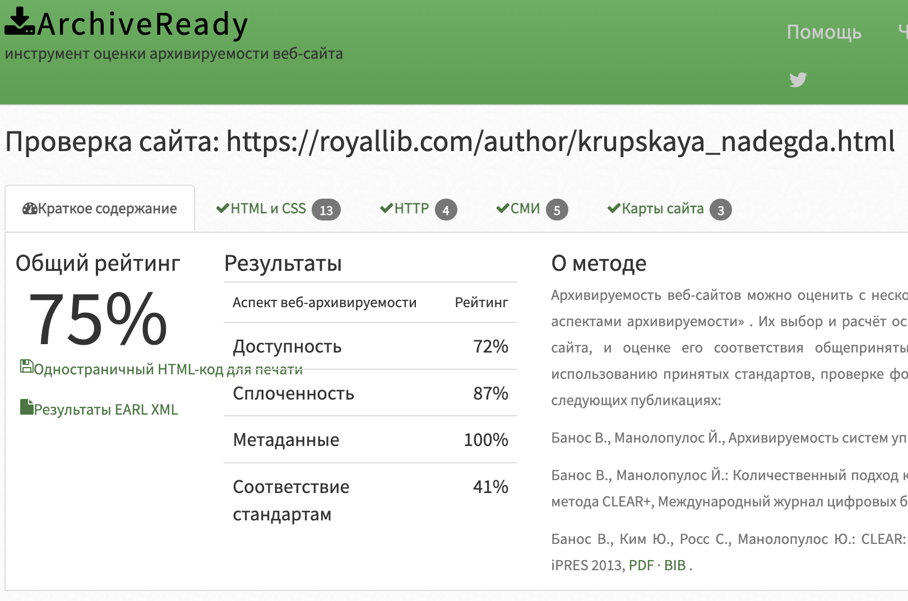

# Архив сайта: **royallib.com/krupskaya_nadegda**
**URL:** https://royallib.com/author/krupskaya_nadegda  
**Дата архивации:** 2025.11.23  
**Метод:** скачивание через прямые ссылки

---

### Анализ архивируемости
Проверка архивируемости выполнена через **https://archiveready.com**

**Основные показатели:**

- Общий рейтинг: 75% 
- Robots.txt: There are "Disallow:" commands in your robots.txt file 
- Sitemap: Sitemap file exists https://royallib.com/sitemap.xml 

 
**Скриншот результата:** 

* **Accessibility (доступность)** — может ли краулер получить доступ ко всем компонентам сайта — страницам, изображениям, скриптам; следит, открываются ли ресурсы по HTTP.
* **Cohesion (целостность/сплоченность)** - насколько сайт организован так, что все ресурсы связаны логично, нет «битых» ссылок или внешних зависимостей, которые краулер не может достать.
* **Metadata Usage (использование метаданных)** - наличие и корректная структура метаданных (урлов, описаний, MIME-типов и др.), что помогает корректному сохранению и извлечению контента позже.
* **Standards Compliance (соответствие стандартам)** - соответствует ли HTML/CSS/JS стандартам, корректно ли оформлен код, нет ли ошибок, которые помешают корректному парсингу/рендерингу.

---

### Архивирование (`wpull`)

Сначала пробовала рекурсивное скачивание через wpull, но оно не позволяло корректно получить тексты. 
Использовала скачивание готовых архивов .zip с текстами в формате .txt через прямые ссылки. 
Тексты представлены в читаемом виде, без HTML-разметки, каждый файл соответствует отдельному произведению. 
Это позволяет работать с текстами напрямую, без дополнительной очистки. Удобно для лингвистического и стилеметрического анализа текстов, подготовки корпусных данных. 

**WARC-файлы:** находятся в каталоге [`krupskaya_full_download`](https://disk.360.yandex.ru/d/ZaM6L38Q7UYbaA) 

**Результаты:**

- Дата архивации: 23 ноя 2025 20:05
- Downloaded: 179 объектов, 34,1 МБ
- Размер WARC: 162 КБ, 274 КБ, 820 КБ
- Количество WARC-файлов: 3
- Количество загруженных уникальных URL: 147

---

### Анализ метаданных WARC  

* Количество записей: 1078 metadata.jsonl 
* Размер архива: 33,8 МБ

**Распределение по MIME-типам (mimes)** 

| MIME-тип                    |Файлов |Размер (байт)  |Доля  |
|-----------------------------|-------|---------------|------|
| text/html                   | 45    | 1 867 483     | 55%  |
| image/jpeg                  | 21    | 605 457       | 18%  |
| application/javascript      | 24    | 212 210       | 6%   |
| text/css                    | 17    | 121 593       | 4%   |
| image/gif                   | 16    | 46 149        | 1%   |
| image/png                   | 20    | 37 799        | 1%   |
| image/vnd.microsoft.icon    | 3     | 4 173         | <1%  |
| image/svg+xml               | 1     | 1 906         | <1%  |

**Распределение по расширениям (exts)** 

|Расширение  |Файлов  |Размер (байт)    |
|------------|--------|-----------------|
| .html      |   26   |   1 343 683     |
| .jpg       |   21   |   605 457       |
| .txt       |   12   |   331 122       |
| .js        |   24   |   212 210       |
| .css       |   17   |   121 593       |
| .png       |   23   |   92 846        |
| .gif       |   16   |   46 149        |
| .svg       |    2   |   29 431        |
| .woff      |    1   |   27 526        |
| .eot       |    1   |   27 525        |
| .ttf       |    1   |   27 525        |
| .ico       |    3   |   4 173         |

---

### Краткий отчет

Архив **содержит в основном HTML-страницы и изображения JPEG**, которые занимают большую часть объема.  
Вспомогательные файлы (CSS, JS, шрифты, PNG, GIF, SVG, ICO) занимают меньшую часть.  
Общий размер архива (~33,8 МБ) делает его удобным для дальнейшей обработки и анализа.  
Количество уникальных URL: 147, что обеспечивает хорошее покрытие контента сайта.

---

### Лицензия
Полную информацию смотрите в файле [LICENSE](https://github.com/AButon-8/web_archive_collection/blob/main/LICENSE) 

